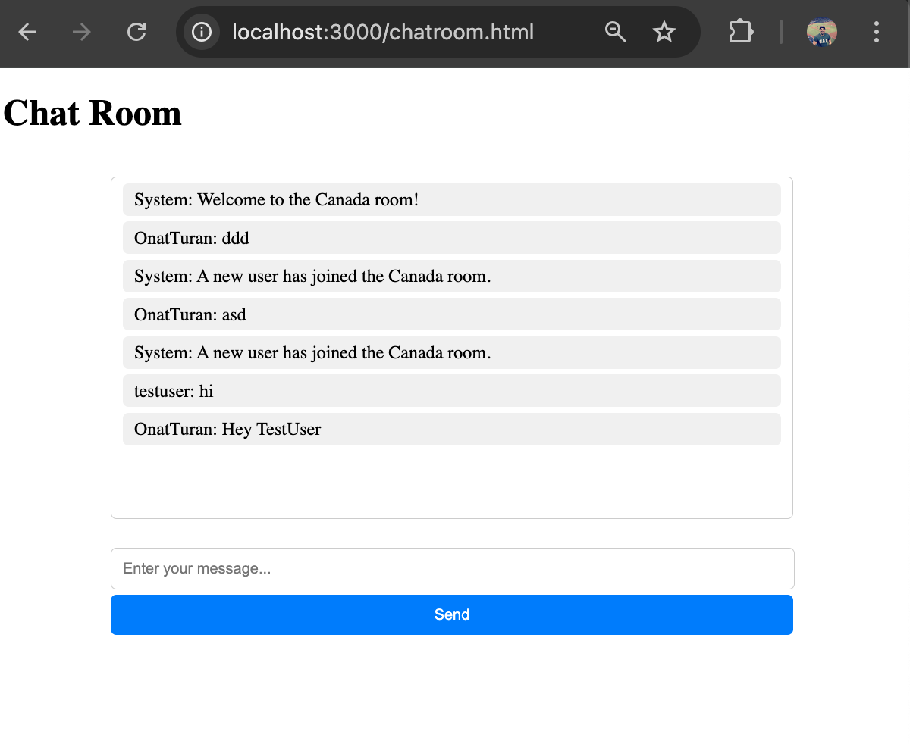

# 101216227 Lab Test 1 Chat App

Real-Time Chat Room Application 🚀

Welcome to the Real-Time Chat Room Application, a fully functional chat platform built using modern technologies like Node.js, Socket.IO, and MongoDB. This application provides an interactive space where users can join different chat rooms, send and receive real-time messages, and enjoy a seamless user experience.

Features ✨
Room-Based Messaging: Users can join specific chat rooms to have focused discussions.
Real-Time Communication: Instant messaging powered by Socket.IO ensures no delay.
Typing Indicators: Know when someone is typing a message to enhance interactivity.
MongoDB Integration: Chat messages are saved securely for future retrieval.
User Authentication: Simple login and signup system with user validation.
Modern UI Design: Clean and responsive design for a great user experience.
Technologies Used 🛠️
Backend: Node.js, Express.js
Frontend: HTML, CSS (Styled for a modern look)
Database: MongoDB
Real-Time Communication: Socket.IO
Hosting: Localhost (for now 😉)